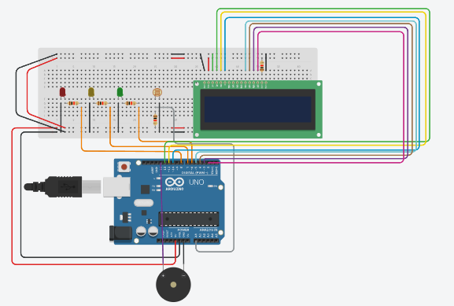
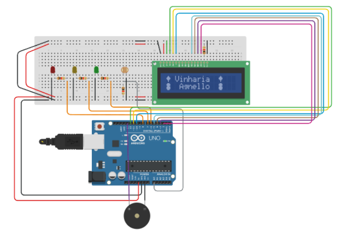
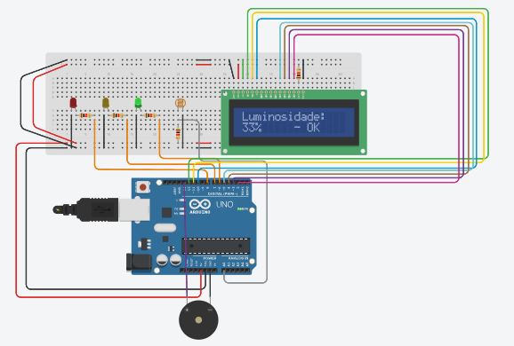
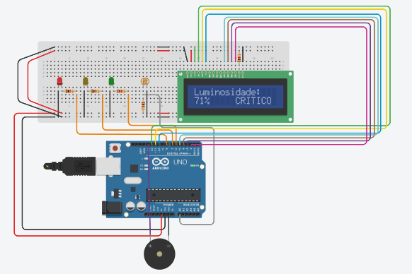

# Sistema de Monitoramento de Luminosidade para Vinheria

Projeto desenvolvido para a **Vinheria Agnello** como parte do desafio de criar um sistema de monitoramento de ambiente para armazenamento de vinhos.

## 📋 Descrição do Projeto

O sistema monitora continuamente os níveis de luminosidade do ambiente onde os vinhos são armazenados, alertando quando as condições não estão ideais. A qualidade do vinho é diretamente influenciada pelas condições de armazenamento, especialmente pela luminosidade.

### Fatores Monitorados:
- **Luminosidade**: Os vinhos devem ser armazenados em ambientes com baixa luminosidade (0-40%)
- **Sistema de Alerta**: Notifica em tempo real quando há desvios nos níveis ideais

## 🎯 Funcionalidades

- ✅ Monitoramento contínuo de luminosidade usando sensor LDR
- ✅ Cálculo de média móvel com 10 leituras para maior estabilidade
- ✅ Display LCD 16x2 com logo customizada e informações em tempo real
- ✅ Sistema de alertas visuais com 3 LEDs (Verde, Amarelo, Vermelho)
- ✅ Alarme sonoro (buzzer) para níveis de alerta e crítico
- ✅ Monitor serial para debug e acompanhamento detalhado

## 🚦 Níveis de Alerta

| Nível | Luminosidade | LED | Buzzer | Status |
|-------|--------------|-----|--------|--------|
| **OK** | 0% - 40% | 🟢 Verde | Desligado | Ambiente ideal |
| **ALERTA** | 41% - 65% | 🟡 Amarelo | 3 seg ON/OFF | Atenção necessária |
| **CRÍTICO** | 66% - 100% | 🔴 Vermelho | 3 seg ON/OFF | Ação imediata |

## 🔧 Componentes Utilizados

### Hardware:
- 1x Arduino Uno R3
- 1x Display LCD 16x2
- 1x Sensor LDR (Fotoresistor)
- 1x Resistor 10kΩ (pull-down para LDR)
- 3x LEDs (Verde, Amarelo, Vermelho)
- 3x Resistores 220Ω (para LEDs)
- 1x Buzzer
- Fios de conexão (jumpers)
- 1x Protoboard

### Software:
- Arduino IDE
- Biblioteca: `LiquidCrystal.h`

## 📸 Visualização do Projeto
## Circuito no Tinkercad


<br>
Vista geral do circuito montado no Tinkercad

## Tela de Boas-vindas


<br>
Display LCD mostrando mensagem de boas-vindas com ícones customizados

## Sistema em Funcionamento


<br>
Sistema em estado OK - LED verde aceso (0-40% luminosidade)
<hr>

<br>
Sistema em estado de alerta - LED amarelo aceso + buzzer (41-65% luminosidade)
<hr>

<br>
Sistema em estado crítico - LED vermelho aceso + buzzer (66-100% luminosidade)

## 📐 Diagrama de Conexões

### Pinos do Arduino:

```
DISPLAY LCD:
- RS  → Pino 12
- E   → Pino 11
- D4  → Pino 10
- D5  → Pino 5
- D6  → Pino 4
- D7  → Pino 3

LEDS:
- LED Verde    → Pino 6
- LED Amarelo  → Pino 7
- LED Vermelho → Pino 8

SENSORES/ALARMES:
- LDR    → Pino A0
- Buzzer → Pino 13
```

## 🚀 Como Executar

### No Tinkercad:
1. Acesse o link do projeto: www.tinkercad.com/things/fDY7kEMlbAE-checkpoint01-edge-computing
2. Clique em "Iniciar Simulação"
3. Ajuste o slider do LDR para simular diferentes níveis de luminosidade
4. Observe o comportamento dos LEDs, buzzer e display

### No Arduino físico:
1. Baixe o arquivo `sistema_monitoramento_vinheria.ino`
2. Abra no Arduino IDE
3. Conecte os componentes conforme o diagrama
4. Faça o upload do código para o Arduino
5. Abra o Monitor Serial (9600 baud) para ver as leituras

## 💡 Como Funciona

### Sistema de Média Móvel:
O sistema calcula a média das últimas **10 leituras** do sensor LDR para evitar falsos alarmes causados por variações momentâneas de luz. Isso garante maior estabilidade e confiabilidade.

### Algoritmo de Mapeamento:
```cpp
int luminosidadePercent = map(media, 0, 1023, 0, 100);
```
Converte a leitura analógica (0-1023) para porcentagem (0-100%).

### Controle do Buzzer:
O buzzer toca por **3 segundos** quando detecta nível de alerta ou crítico, depois desliga e volta a tocar se a condição persistir, criando um padrão intermitente de alerta.

## 📊 Fluxograma de Funcionamento

```
Início
  ↓
Ler 10 valores do LDR
  ↓
Calcular média
  ↓
Converter para %
  ↓
Luminosidade < 40%? → SIM → LED Verde
  ↓ NÃO
Luminosidade < 65%? → SIM → LED Amarelo + Buzzer
  ↓ NÃO
LED Vermelho + Buzzer
  ↓
Aguardar 1 segundo
  ↓
Repetir
```

## 📝 Código Comentado

O código está totalmente comentado em português para facilitar o entendimento. Principais funções:

- `setup()`: Inicialização dos componentes e tela de boas-vindas
- `loop()`: Leitura contínua e processamento de dados
- `verificarCondicoes()`: Avalia níveis e aciona alertas
- `controlarBuzzer()`: Gerencia o padrão intermitente do buzzer
- `apagarTodosLEDs()`: Garante que apenas um LED esteja aceso por vez

## 🎨 Recursos Visuais

### Tela de Boas-vindas:
```
🍃 Vinharia  🍃
🍇  Agnello  🍇
```
Caracteres customizados representam folhas de parreira e cachos de uva.

### Tela de Monitoramento:
```
Luminosidade:
45% ALERTA
```

## 📚 Dependências

```cpp
#include <LiquidCrystal.h>
```

Esta biblioteca já vem instalada por padrão no Arduino IDE.

## 👥 Autores

- **João Victor (RM: 566640)**
- **Gustavo Macedo (RM: 567594)**
- **Gustavo Hiruo (RM: 567625)**
- **Yan Lucas (RM: 567046)**

Projeto FIAP - Vinheria Agnello

## 📄 Licença

Este projeto foi desenvolvido para fins educacionais como parte do curso da FIAP.

## 🔗 Links

- [Simulação no Tinkercad](https://www.tinkercad.com/things/fDY7kEMlbAE-checkpoint01-edge-computing)
- [Vídeo explicativo](INSERIR_LINK_VIDEO_AQUI)
- [Documentação Arduino](https://www.arduino.cc/reference/en/)

---

**Data de desenvolvimento**: Outubro 2024
